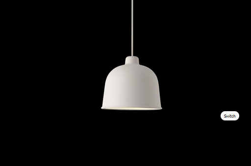

# On-off-lamp
A simple html page that switches on a lamp.

## Screenshot

## Use tech
1. HTML
1. CSS
1. JAVASCRIPT

## Flow
- When the user visites the page, they see a turned off lamp
- When the button is clicked, javascript toggles a `d-none` class
- The lamp shows the shine and seems to be turned on

## javascript implementation

```javascript
const button = document.getElementById("button")
button.addEventListener("click", (e) => {
    document.getElementById("main-light").classList.toggle("d-none")
})
```


## Credits
Build by [Frank](https://github.com/fraankrr), thanks to `henry` for help